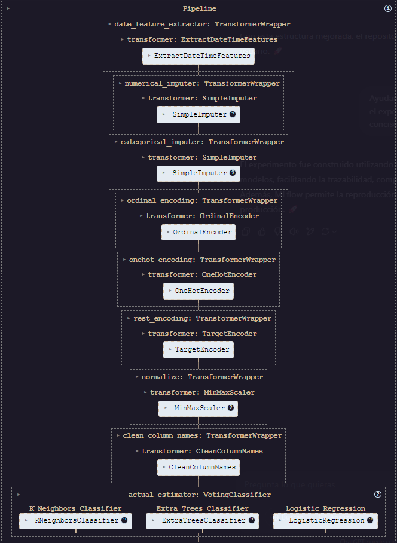
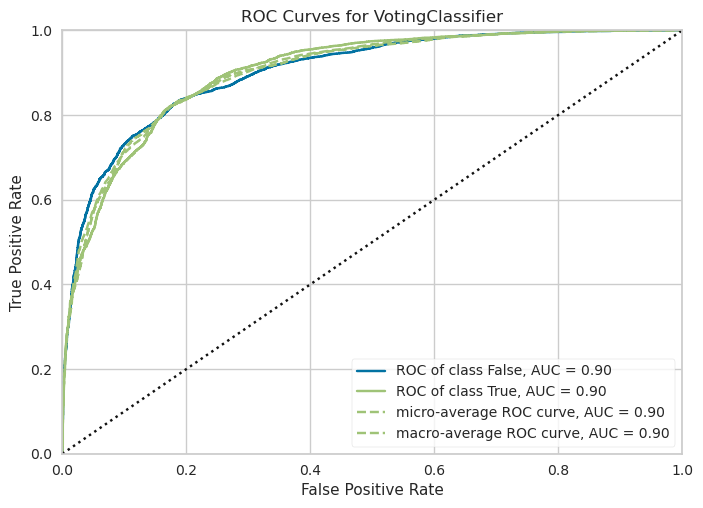
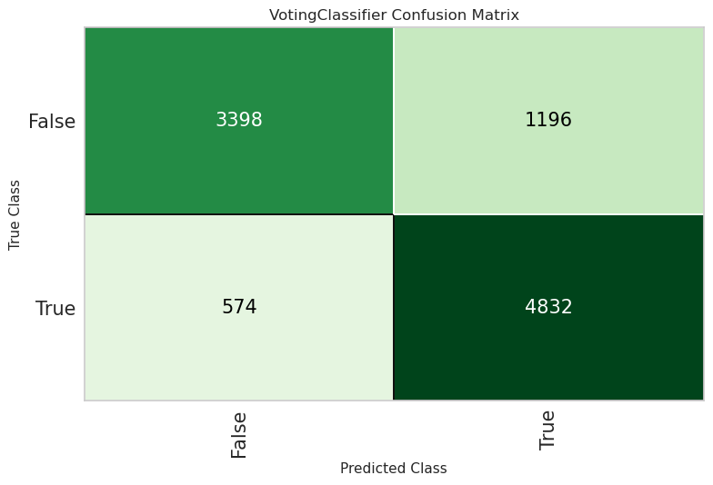
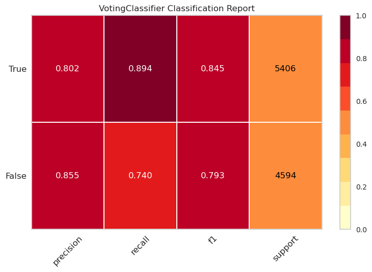
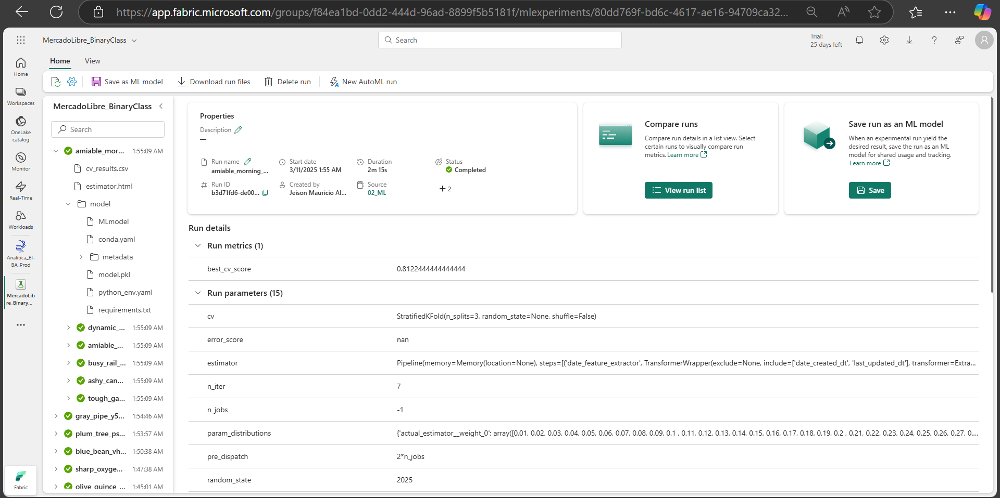

# 📦 **Binary Classification Model for New/Used Item Prediction | MercadoLibre** 🛒

Este proyecto desarrolla un 🖥️ programa para procesar un 📊 conjunto de datos y entrenar un 🤖 clasificador binario que distingue entre artículos **"nuevos (1)"** ✨ y **"usados (0)"** 🔄 en MercadoLibre.

Además, incorpora un ⚙️ mecanismo de prueba para evaluar su desempeño, alcanzando un **Accuracy** 🎯 de **0.884** y un **AUC** 📈 de aproximadamente **0.9**. 🚀

___

## 🧩 **0. Estructura del Repositorio** 🗂️

```
└── 📁Mercado Libre - MeLi
        └── config
        └── description
        └── HEAD
        └── 📁hooks
            └── applypatch-msg.sample
            └── commit-msg.sample
            └── fsmonitor-watchman.sample
            └── post-update.sample
            └── pre-applypatch.sample
            └── pre-commit.sample
            └── pre-merge-commit.sample
            └── pre-push.sample
            └── pre-rebase.sample
            └── pre-receive.sample
            └── prepare-commit-msg.sample
            └── push-to-checkout.sample
            └── sendemail-validate.sample
            └── update.sample
        └── index
        └── 📁info
            └── exclude
        └── 📁logs
            └── HEAD
            └── 📁refs
                └── 📁heads
                    └── main
                └── 📁remotes
                    └── 📁origin
                        └── HEAD
        └── 📁objects
            └── 📁info
            └── 📁pack
                └── pack-f4abe2f4e7c81fa932699b66e7b2cebafc0cc69a.idx
                └── pack-f4abe2f4e7c81fa932699b66e7b2cebafc0cc69a.pack
                └── pack-f4abe2f4e7c81fa932699b66e7b2cebafc0cc69a.rev
        └── packed-refs
        └── 📁refs
            └── 📁heads
                └── main
            └── 📁remotes
                └── 📁origin
                    └── HEAD
            └── 📁tags
    └── 📁app
        └── Copia de MLA_100k_checked_v3.jsonlines
        └── init.py
        └── logs.log
        └── ▶️ Notebook.ipynb 🟢
    └── 📁data
        └── Data_transformed.parquet.gzip
        └── X_test_transformed.parquet.gzip
        └── X_train_transformed.parquet.gzip
        └── y_test.parquet.gzip
        └── y_train.parquet.gzip
    └── 📁logs
        └── logs.log
    └── 📁mlflow_experiments
        └── cv_results.csv
        └── estimator.html
        └── 📁model
            └── conda.yaml
            └── 📁metadata
                └── conda.yaml
                └── MLmodel
                └── python_env.yaml
                └── requirements.txt
            └── MLmodel
            └── model.pkl
            └── python_env.yaml
            └── requirements.txt
    └── .gitignore
    └── environment.yml
    └── Final_Model_MercadoLibre.pkl
    └── LICENSE
    └── poetry.lock
    └── pyproject.toml
    └── README.md
```

___

## 🏗️ **0. Arquitectura de Gestión de Dependencias** 🔗
Mi proyecto utiliza **dos herramientas complementarias** para gestión de entornos y paquetes, lo que lo hace más robusto que un simple `requirements.txt`:

### **a. `environment.yml` (Conda)**
- **Propósito**: Define el entorno base con control preciso de versiones de Python y herramientas esenciales.
- **Ventajas clave**:
  - ✅ **Gestión de Python y paquetes no-Python**: Conda maneja dependencias del sistema (compiladores, CUDA, etc.), crítico para paquetes como `xgboost`/`lightgbm`.
  - ✅ **Versionado estricto**: `python==3.9.21` evita conflictos en futuras actualizaciones.
  - ✅ **Integración con Poetry**: Combina lo mejor de Conda (entorno base) y Poetry (gestión de paquetes Python).
### **b. `pyproject.toml` (Poetry)**
- **Propósito**: Gestiona dependencias específicas del proyecto y metadatos como un sistema moderno de empaquetado.
- **Ventajas vs `requirements.txt`**:
  - ✅ **Dependencias versionadas con semver**: Evita "dependency hell" al especificar rangos compatibles (`xgboost>=2.1.4,<3.0.0`).
  - ✅ **Lockfile automático**: Poetry genera `poetry.lock` con versiones exactas para reproducibilidad.
  - ✅ **Metadatos estructurados**: Autores, descripción y dependencias en un formato estandarizado (PEP 621).

___

## ⚡ **1. Stack Tecnológico Sofisticado** 🔧
Mis dependencias reflejan **optimización para ciencia de datos industrial**:

|  **Paquete** 	|                      **Rol en el Proyecto**                      	|                             **Ventaja vs Alternativas**                             	|
|:------------:	|:----------------------------------------------------------------:	|:-----------------------------------------------------------------------------------:	|
|  **PyCaret** 	| Automatización de ML (EDA, modelado, comparación de 15+ modelos) 	|              Reduce código repetitivo en un 70% vs scikit-learn manual.             	|
|  **XGBoost** 	|            Modelo principal para clasificación binaria           	|          Mayor velocidad/performance vs Random Forest en datasets grandes.          	|
| **LightGBM** 	|                 Alternativa eficiente en memoria                 	|                    Ideal si el dataset crece (ej: >1M registros).                   	|
|  **Kaleido** 	|                 Exportación de gráficos (Plotly)                 	| Permite guardar visualizaciones en formato vectorial para documentos profesionales. 	|

___

## ⚙️ **2. Procesamiento de Datos e Implementación con Programación Orientada a Objetos (POO)** 💡

### 1️⃣ *Change Type and Filter Columns*

```python
SCHEMA = {
    'accepts_mercadopago': 'bool',
    'price': 'float64',
    # ... (otras conversiones)
}
RemoveCols = [
    'attributes', 'differential_pricing',
    # ... (45+ columnas removidas)
]
```

**Acciones clave**:

- **Normalización de tipos**:
  - Conversión precisa de tipos usando `astype(SCHEMA)` para optimizar memoria y evitar errores de modelado.
- **Eliminación estratégica**:
  - +45 columnas removidas (ej: metadatos irrelevantes como `permalink`, `video_id`) usando `drop()` con validación `errors='ignore'`.

### 2️⃣ *Transform Columns*

```python
# Ej: One-Hot Encoding de métodos de pago
paymentSeries.apply(lambda x: [d['description'] for d in x])
oneHot = MLB.fit_transform(paymentSeries)
```

**Técnicas aplicadas**:

|     **Transformación**     	|         **Método/Clase**         	|                **Impacto**               	|
|:--------------------------:	|:--------------------------------:	|:----------------------------------------:	|
|   *Codificación temporal*  	| `pd.to_datetime()` + operaciones 	|      Feature engineering: `age_days`     	|
|     *One-Hot Encoding*     	|       `MultiLabelBinarizer`      	|  15+ métodos de pago → columnas binarias 	|
| *Textualización de listas* 	| `.apply(lambda x: ', '.join(x))` 	| `tags` → texto analizable por NLP futuro 	|
|    *Conteo de elementos*   	|       `count_list_fields()`      	|  `pictures_count` como proxy de calidad  	|

### 3️⃣ *Ventajas Clave de la Arquitectura POO*

```python
class DatasetProcessor:
    def __init__(self, filename, test_size):
        # Inicialización parametrizada
    def load_raw_data(self):
        # Lógica encapsulada
    # +7 métodos especializados
```

1. **Modularidad y Reusabilidad**
   - La clase `DatasetProcessor` encapsula **todo el pipeline de datos**:
     - Carga desde JSON (`load_raw_data`)
     - Transformaciones complejas (`transform_datetime`, `onehot_payments`)
     - Limpieza consistente para Train/Test (`cleaned_dataset`)
   - **Beneficio**: Mismo procesamiento aplicado a ambos conjuntos sin duplicar código.

2. **Mantenibilidad**
   - Métodos con responsabilidades únicas:
     - `count_list_fields()` → Solo conteo de listas
     - `list2text()` → Solo conversión texto
   - **Beneficio**: Debugging focalizado y actualizaciones seguras.

3. **Escalabilidad Industrial**
   - `BinaryClassifier` preparada para extensión:
     - Setup con PyCaret (`setup_training_pipeline()`)

### 4️⃣ *Ejecución del Pipeline*

```bash
# Instalar dependencias (Conda + Poetry)
conda env create -f environment.yml
conda activate ML_Binary_Classification
poetry install

# Ejemplo de uso
processor = DatasetProcessor(filename = 'Abc.jsonlines')
X_train, X_test = processor.cleaned_dataset()

model = BinaryClassifier(fold_strategy = 'stratifiedkfold')
model.setup_training_pipeline(X_train, X_test, target = 'Target')
```

___

## 🤖 **3. Desarrollo de los Modelos y Resultados** 📊

### **1️⃣ Pipeline de Preprocesamiento**



El modelo utiliza una serie de transformaciones para preparar los datos antes del entrenamiento. Estas incluyen:

- **Extracción de características de fecha**: Se generan nuevas variables a partir de `date_created_dt` y `last_updated_dt`.
- **Imputación de valores faltantes**:
  - **Númericos**: Se reemplazan valores faltantes con `0`.
  - **Categóricos**: Se completan con el valor más frecuente.
- **Codificación de variables categóricas**:
  - **Ordinal Encoding**: Se aplica a `currency_id`.
  - **One-Hot Encoding**: Se usa en variables como `listing_type_id`, `buying_mode` y `status`.
  - **Target Encoding**: Se aplica a `title` y `seller_address_city_name`.
- **Normalización**: Se usa **MinMaxScaler** para escalar valores numéricos entre 0 y 1.
- **Limpieza de nombres de columnas**: Se estandarizan los nombres de las variables.

### **2️⃣ Modelo de Clasificación**

Se implementa un **VotingClassifier** con los siguientes modelos base:

1. **K-Nearest Neighbors (KNN)**: Modelo basado en la distancia entre puntos de datos.
2. **Extra Trees Classifier**: Ensamble de árboles de decisión para mejorar la precisión y reducir el sobreajuste.
3. **Regresión Logística**: Modelo lineal para clasificación con ajuste de 1000 iteraciones.

🔹 **Votación "soft"**: Cada modelo asigna probabilidades y se ponderan para obtener la predicción final.
🔹 **Pesos de los modelos**:
   - **KNN (50%)**
   - **Extra Trees (30%)**
   - **Regresión Logística (20%)**

### **3️⃣ Curva ROC y AUC**





📌 **Descripción:**

- La **Curva ROC (Receiver Operating Characteristic)** muestra el rendimiento del clasificador en diferentes umbrales de decisión.
- El **Área Bajo la Curva (AUC)** cuantifica la capacidad del modelo para diferenciar entre clases.

📊 **Interpretación:**
- El modelo tiene un **AUC de 0.90** para ambas clases (`True` y `False`), lo que indica un **alto poder predictivo**.
- Una curva más alejada de la diagonal (*línea punteada*) sugiere que el modelo es **bueno en la clasificación**.

✅ **Conclusión:**
El modelo tiene **buen rendimiento** y puede diferenciar bien entre clases, aunque aún hay margen de mejora.

### **4️⃣ Matriz de Confusión**

📌 **Descripción:**

- Muestra los verdaderos positivos (TP), verdaderos negativos (TN), falsos positivos (FP) y falsos negativos (FN).
- Se usa para evaluar **precisión, recall y exactitud del modelo**.

📊 **Interpretación:**

| **Clase Real →** | **Predicho: Falso** | **Predicho: Verdadero** |
|------------------|------------------|------------------|
| **Falso** (Negativo) | **3398 (TN)** ✅ | **1196 (FP)** ❌ |
| **Verdadero** (Positivo) | **574 (FN)** ❌ | **4832 (TP)** ✅ |

📌 **Métricas clave:**

- **Precisión (Precision)** = TP / (TP + FP) = \( \frac{4832}{4832 + 1196} \) ≈ **80.2%**
  → % de predicciones positivas que son correctas.
- **Recall (Sensibilidad)** = TP / (TP + FN) = \( \frac{4832}{4832 + 574} \) ≈ **89.4%**
  → % de casos positivos detectados correctamente.
- **Exactitud (Accuracy)** = (TP + TN) / Total = \( \frac{4832 + 3398}{3398 + 1196 + 574 + 4832} \) ≈ **88.4%**

✅ **Conclusión:**

- El modelo clasifica bien, con **alta sensibilidad (recall)**, capturando la mayoría de los casos positivos.
- Hay **falsos positivos y falsos negativos**, lo que indica margen de mejora en equilibrio entre precisión y recall.
- Se puede mejorar afinando hiperparámetros o ajustando el umbral de clasificación.

📌 **Resumen general:**

✔ **AUC de 0.90** sugiere un modelo con alto poder predictivo.
✔ **Accuracy de 88.4%** indica buen desempeño.
✔ **Recall alto (89.4%)** significa que detecta bien los casos positivos.

🔹 **Recomendación:**

Si el costo de los falsos positivos es alto, podrías ajustar el umbral de decisión para mejorar la precisión a costa de algo de recall.

### **5️⃣ MLFlow & Evidencia**

El experimento fue construido utilizando **MLflow**, lo que permite un seguimiento estructurado de los modelos, facilitando la trazabilidad, comparación de experimentos y gestión de hiperparámetros. Además, MLflow permite la reproducción de resultados y el despliegue eficiente del modelo en producción. 🚀



___

## 📚 **4. Referencias Bibliográficas** 📄

### **Core Libraries & Frameworks**
- 🧠 **PyCaret**: *Low-Code Machine Learning Library in Python*
  [Official Documentation](https://pycaret.gitbook.io/) | [Docs](https://pycaret.readthedocs.io/en/latest/api/classification.html) | [GitHub Repository](https://github.com/pycaret/pycaret)

### **Software Engineering & Reproducibility**
- ⚙️ **Poetry**: *Python Packaging and Dependency Management*
  [Official Documentation](https://python-poetry.org/) | [GitHub Repository](https://github.com/python-poetry/poetry)

___

## ✍🏻 **5. Autor** 🧑🏻‍💻

**Jeison M. Alarcon B.**
*Data Scientist | IA/ML Engineer*
🌐 **Conecta Conmigo**:
[](https://github.com/JeisonAlarcon)
[](mailto:jmalarconbe@unal.edu.co)
[](https://co.linkedin.com/in/jeison-alarcon)
[](https://jeison-alarcon.site/)